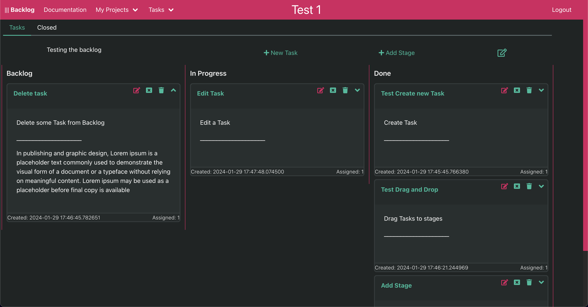

# Backlog

This is a flask web application for organizing project development.
It enables you to assign tasks to projects and move them between 
multiple stages (i.e. In progress; Done etc.) 

# Examples

### Project view

# Get it to run locally

 - Install python
 - Clone repository and create a python venv
 - Activate the venv and install packeges from "requirements.txt" 
    (if pip returns any errors, try installing them one by one)
- Set an environment variable ("FLASK_APP=app/\_\_init\_\_.py")
- Run flask development server 
    flask run 
- Open the local url gevin by flask in command line

# TODO

  - Add aggregate task view, containing all tasks currently not marked as done
