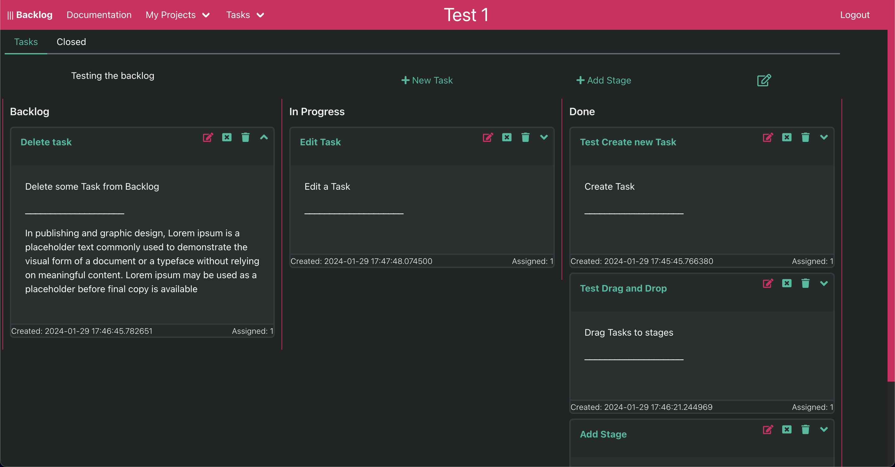

# Backlog

This is a flask web application for organizing project development.
It enables you to assign tasks to projects and move them between 
multiple stages (i.e. In progress; Done etc.) 

# Examples

### Project view


# Get it to run locally

 -  Install Python3 (Via your package manager or https://www.python.org/downloads/)
 -  Clone this repository
 -  Either install dependencies from "requirements.txt" system wide or ideally create a 
    
    virtual environment in project root (/backlog) and install packages from "requirements.txt" there
    
    https://docs.python.org/3/library/venv.html#creating-virtual-environments 

    on Linux(Ubuntu) in "backlog/":
    ```
    python3 -m venv your_venv_name
    ```

    ```
    source your_venv_name/bin/activate
    ```

    ```
    python3 -m pip install -r requirements.txt
    ```

-   Set environment variable for the flask app
    ```
    FLASK_APP=app/\_\_init\_\_.py
    ```
-   (Optional) Set environment variable activating debug mode
    ```
    FLASK_DEBUG=TRUE
    ```
-   Run flask development server
    ```
    flask run
    ```
-   Open the URL given by flask in command line

# TODO

  - Add aggregate task view, containing all tasks currently not marked as done
